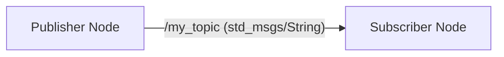
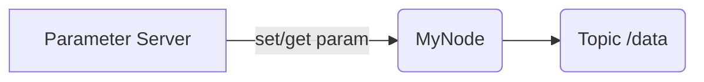

## Overview

This chapter introduces the core concepts and fundamental building blocks of ROS 2 (Robot Operating System 2). We will explore its communication architecture, learn how to create basic ROS 2 components using `rclpy`, and understand how to manage complex robot systems with launch files and parameters.

## Learning Objectives

By the end of this chapter, you will be able to:
- Define and differentiate between ROS 2 nodes, topics, services, and actions.
- Implement simple ROS 2 publishers and subscribers using `rclpy`.
- Understand the purpose and structure of ROS 2 launch files.
- Utilize the ROS 2 parameter server for dynamic configuration.
- Visualize ROS 2 communication graphs using Mermaid diagrams.
- Apply your knowledge through practical exercises.

## ROS 2 Core Concepts

ROS 2 is a flexible framework for writing robot software. It consists of a set of tools, libraries, and conventions that aim to simplify the task of creating complex and robust robot applications.

### Nodes

A **Node** is an executable that performs a specific task. In ROS 2, nodes are the fundamental units of computation. A robot system typically consists of many nodes, each responsible for a small, modular piece of functionality (e.g., a camera driver node, a motor control node, a path planning node).

### Topics

**Topics** are the most common way for nodes to asynchronously exchange data. A node **publishes** messages to a topic, and other nodes **subscribe** to that topic to receive the messages. This is a many-to-many, anonymous, publish-subscribe communication model.

### Services

**Services** provide a synchronous request-reply communication mechanism between nodes. A node acts as a **service server** and responds to requests from **service clients**. Services are suitable for operations that require a direct response, like querying a specific piece of data or triggering a one-time action.

### Actions

**Actions** are designed for long-running, goal-oriented tasks that may be preempted or provide continuous feedback. An **action client** sends a goal to an **action server**, which then provides feedback on the progress and eventually a result. Actions are built on top of topics and services and are ideal for tasks like navigating to a goal or moving a robot arm.

## `rclpy` Examples

`rclpy` is the Python client library for ROS 2. Below are examples of a simple publisher and subscriber.

### Publisher Example

`my_robot_controller/my_robot_controller/simple_publisher.py`
```python
import rclpy
from rclpy.node import Node
from std_msgs.msg import String

class SimplePublisher(Node):

    def __init__(self):
        super().__init__('simple_publisher')
        self.publisher_ = self.create_publisher(String, 'my_topic', 10)
        timer_period = 0.5  # seconds
        self.timer = self.create_timer(timer_period, self.timer_callback)
        self.i = 0

    def timer_callback(self):
        msg = String()
        msg.data = f'Hello ROS 2! {self.i}'
        self.publisher_.publish(msg)
        self.get_logger().info(f'Publishing: "{msg.data}"')
        self.i += 1

def main(args=None):
    rclpy.init(args=args)
    simple_publisher = SimplePublisher()
    rclpy.spin(simple_publisher)
    simple_publisher.destroy_node()
    rclpy.shutdown()

if __name__ == '__main__':
    main()
```

### Subscriber Example

`my_robot_controller/my_robot_controller/simple_subscriber.py`
```python
import rclpy
from rclpy.node import Node
from std_msgs.msg import String

class SimpleSubscriber(Node):

    def __init__(self):
        super().__init__('simple_subscriber')
        self.subscription = self.create_subscription(
            String,
            'my_topic',
            self.listener_callback,
            10)
        self.subscription  # prevent unused variable warning

    def listener_callback(self, msg):
        self.get_logger().info(f'I heard: "{msg.data}"')

def main(args=None):
    rclpy.init(args=args)
    simple_subscriber = SimpleSubscriber()
    rclpy.spin(simple_subscriber)
    simple_subscriber.destroy_node()
    rclpy.shutdown()

if __name__ == '__main__':
    main()
```

## Launch Files

**Launch files** are XML or Python files used to start and configure multiple ROS 2 nodes, set parameters, and manage the execution of a robotic system. They provide a convenient way to orchestrate complex setups.

Example `simple_launch.py`:

```python
from launch import LaunchDescription
from launch_ros.actions import Node

def generate_launch_description():
    return LaunchDescription([
        Node(
            package='my_robot_controller',
            executable='simple_publisher',
            name='my_publisher_node',
            output='screen'
        ),
        Node(
            package='my_robot_controller',
            executable='simple_subscriber',
            name='my_subscriber_node',
            output='screen'
        )
    ])
```

To run this launch file:
`ros2 launch my_robot_controller simple_launch.py`

## Parameter Server

The **ROS 2 Parameter Server** allows nodes to store and retrieve parameters at runtime. Parameters are typically static configuration values that can be loaded from YAML files or set directly via the command line. This enables flexible configuration without recompiling code.

### Setting and Getting Parameters

-   **From command line:** `ros2 param set /my_publisher_node timer_period 1.0`
-   **From YAML file:** Use a `config` directory in your package with a `.yaml` file, then reference it in a launch file.

Example `params/my_params.yaml`:

```yaml
simple_publisher:
  ros__parameters:
    timer_period: 0.75
```

And in the launch file:

```python
from launch import LaunchDescription
from launch_ros.actions import Node
from ament_index_python.packages import get_package_share_directory
import os

def generate_launch_description():
    config = os.path.join(
        get_package_share_directory('my_robot_controller'),
        'params',
        'my_params.yaml'
        )

    return LaunchDescription([
        Node(
            package='my_robot_controller',
            executable='simple_publisher',
            name='simple_publisher',
            output='screen',
            parameters=[config]
        ),
        Node(
            package='my_robot_controller',
            executable='simple_subscriber',
            name='simple_subscriber',
            output='screen'
        )
    ])
```

## Mermaid Diagrams of ROS Graph

Mermaid can be used to visualize the communication graph of ROS 2 systems.

### Simple Publisher-Subscriber Graph



### Node with Parameters Graph



## Exercises & Quizzes

1.  **Question:** Explain the difference between ROS 2 Topics and Services. When would you choose to use one over the other?
2.  **Question:** Modify the `simple_publisher.py` example to publish a custom message type (e.g., `geometry_msgs/msg/Twist`) instead of `std_msgs/msg/String`. You'll need to create a `setup.py` and `package.xml` for your package and define the message in a `msg` directory.
3.  **Code Task:** Create a new ROS 2 node that subscribes to the `/scan` topic (publishing `sensor_msgs/msg/LaserScan` data, assume it exists) and prints the minimum range detected to the console. (Hint: you'll need to import `sensor_msgs.msg.LaserScan`).
4.  **Diagramming Task:** Draw a Mermaid graph for a ROS 2 system that includes:
    -   A `camer-node` publishing to `/image_raw` (Image) and `/camer-info` (CameraInfo).
    -   A `detector_node` subscribing to `/image_raw` and publishing to `/objects` (BoundingBoxArray).
    -   A `controller_node` subscribing to `/objects` and publishing to `/cmd_vel` (Twist).
5.  **Multiple Choice:** Which ROS 2 communication concept is best suited for long-running tasks with continuous feedback and potential preemption?
    -   A) Topics
    -   B) Services
    -   C) Actions
    -   D) Parameters
